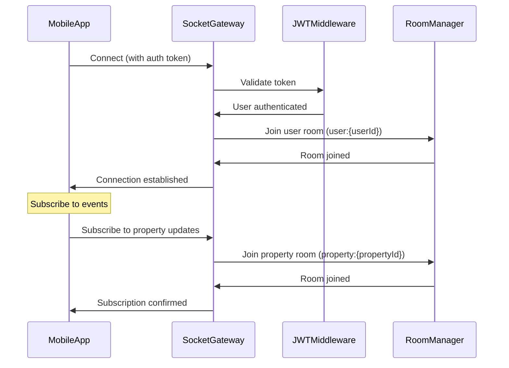

# Real-time Architecture: WebSocket Integration

**Version**: 1.0  
**Last Updated**: 2025-01-12  
**Purpose**: Complete WebSocket/Socket.io implementation for real-time updates in Blocks mobile app

---

## Table of Contents

1. [Overview](#1-overview)
2. [Architecture](#2-architecture)
3. [Event Specifications](#3-event-specifications)
4. [Backend Implementation](#4-backend-implementation)
5. [Frontend Implementation](#5-frontend-implementation)
6. [Room Management](#6-room-management)
7. [Event Integration](#7-event-integration)
8. [Offline Support](#8-offline-support)
9. [Security](#9-security)
10. [Testing](#10-testing)

---

## 1. Overview

### Why Real-time Updates?

**Critical for User Experience**:
- Wallet balance updates after deposits/withdrawals
- Investment confirmations
- Transaction status changes
- Property funding progress
- Reward distributions
- Notification delivery

### Technology Stack

- **Backend**: Socket.io with NestJS Gateway
- **Frontend**: socket.io-client for React Native
- **Transport**: WebSocket with long-polling fallback
- **Authentication**: JWT token validation
- **Events**: Integration with existing NestJS EventEmitter

---

## 2. Architecture

### System Diagram

```
┌─────────────────────────────────────────────────────┐
│           React Native Mobile App                   │
│                                                     │
│  ┌─────────────────────────────────────────────┐  │
│  │        socket.io-client                     │  │
│  │  - Auto-reconnect                           │  │
│  │  - Event listeners                          │  │
│  │  - Room subscription                        │  │
│  └──────────────────┬──────────────────────────┘  │
└─────────────────────┼──────────────────────────────┘
                      │
                      │ WebSocket/HTTP
                      │ JWT Authentication
                      │
┌─────────────────────▼──────────────────────────────┐
│              NestJS Backend                        │
│                                                     │
│  ┌─────────────────────────────────────────────┐  │
│  │       Socket.io Gateway                     │  │
│  │  - Authentication middleware                │  │
│  │  - Room management                          │  │
│  │  - Event broadcasting                       │  │
│  └──────────────────┬──────────────────────────┘  │
│                     │                               │
│  ┌──────────────────▼──────────────────────────┐  │
│  │      NestJS Event Emitter                   │  │
│  │  - wallet.balance_updated                   │  │
│  │  - investment.created                       │  │
│  │  - transaction.status_changed               │  │
│  │  - property.funding_updated                 │  │
│  │  - reward.distributed                       │  │
│  │  - notification.created                     │  │
│  └──────────────────┬──────────────────────────┘  │
│                     │                               │
│  ┌──────────────────▼──────────────────────────┐  │
│  │         Business Logic Services             │  │
│  │  - WalletService                            │  │
│  │  - InvestmentService                        │  │
│  │  - TransactionService                       │  │
│  │  - PropertyService                          │  │
│  │  - RewardService                            │  │
│  │  - NotificationService                      │  │
│  └─────────────────────────────────────────────┘  │
└─────────────────────────────────────────────────────┘
```

### Connection Flow



---

## 3. Event Specifications

### 3.1 Wallet Events

#### `wallet:balance_updated`
**Trigger**: Deposit, withdrawal, reward distribution, investment
**Payload**:
```typescript
{
  userId: string;
  walletId: string;
  balance: {
    usdc: number;
    locked: number;
    totalValue: number;  // includes portfolio value
  };
  change: {
    amount: number;
    type: 'deposit' | 'withdrawal' | 'reward' | 'investment';
    transactionId: string;
  };
  timestamp: string;
}
```

**Frontend Handler**:
```typescript
socket.on('wallet:balance_updated', (data) => {
  // Update wallet state
  setWalletBalance(data.balance);
  
  // Show toast notification
  showToast(`Balance updated: ${data.change.type} of ${data.change.amount} USDC`);
  
  // Refresh wallet screen if open
  queryClient.invalidateQueries(['wallet', data.userId]);
});
```

---

### 3.2 Investment Events

#### `investment:created`
**Trigger**: New investment confirmed
**Payload**:
```typescript
{
  userId: string;
  investmentId: string;
  investment: {
    id: string;
    propertyId: string;
    propertyTitle: string;
    tokens: number;
    amount: number;
    status: 'pending' | 'confirmed';
  };
  timestamp: string;
}
```

#### `investment:confirmed`
**Trigger**: Investment status changes to confirmed
**Payload**:
```typescript
{
  userId: string;
  investmentId: string;
  investment: {
    id: string;
    propertyId: string;
    propertyTitle: string;
    tokens: number;
    amount: number;
    status: 'confirmed';
    transactionHash: string;
  };
  timestamp: string;
}
```

---

### 3.3 Transaction Events

#### `transaction:status_changed`
**Trigger**: Transaction status update (pending → completed/failed)
**Payload**:
```typescript
{
  userId: string;
  transactionId: string;
  transaction: {
    id: string;
    type: 'deposit' | 'withdraw' | 'investment' | 'rental_income';
    amount: number;
    status: 'completed' | 'failed';
    previousStatus: 'pending';
    description: string;
  };
  timestamp: string;
}
```

---

### 3.4 Property Events

#### `property:funding_updated`
**Trigger**: New investment in property
**Payload**:
```typescript
{
  propertyId: string;
  property: {
    id: string;
    title: string;
    totalTokens: number;
    soldTokens: number;
    availableTokens: number;
    fundingProgress: number;  // percentage
  };
  timestamp: string;
}
```

**Frontend Handler**:
```typescript
socket.on('property:funding_updated', (data) => {
  // Update property funding progress bar
  queryClient.setQueryData(['property', data.propertyId], (old) => ({
    ...old,
    soldTokens: data.property.soldTokens,
    availableTokens: data.property.availableTokens,
    fundingProgress: data.property.fundingProgress,
  }));
});
```

#### `property:status_changed`
**Trigger**: Property status update
**Payload**:
```typescript
{
  propertyId: string;
  property: {
    id: string;
    title: string;
    status: 'funding' | 'construction' | 'completed' | 'generating-income';
    previousStatus: string;
  };
  timestamp: string;
}
```

---

### 3.5 Reward Events

#### `reward:distributed`
**Trigger**: ROI reward distributed to user
**Payload**:
```typescript
{
  userId: string;
  rewardId: string;
  reward: {
    id: string;
    amount: number;
    type: 'roi' | 'referral' | 'bonus';
    investmentId: string;
    propertyId: string;
    propertyTitle: string;
    description: string;
  };
  timestamp: string;
}
```

**Frontend Handler**:
```typescript
socket.on('reward:distributed', (data) => {
  // Show celebration animation
  showRewardAnimation(data.reward.amount);
  
  // Update portfolio
  queryClient.invalidateQueries(['portfolio']);
  queryClient.invalidateQueries(['wallet']);
  
  // Create notification
  createNotification({
    title: 'Reward Received! 🎉',
    body: `You received ${data.reward.amount} USDC from ${data.reward.propertyTitle}`,
    type: 'reward',
  });
});
```

---

### 3.6 Notification Events

#### `notification:new`
**Trigger**: New notification created for user
**Payload**:
```typescript
{
  userId: string;
  notification: {
    id: string;
    type: string;
    title: string;
    body: string;
    data?: {
      propertyId?: string;
      investmentId?: string;
      transactionId?: string;
      url?: string;
    };
    read: boolean;
    createdAt: string;
  };
  timestamp: string;
}
```

**Frontend Handler**:
```typescript
socket.on('notification:new', (data) => {
  // Add to notification list
  queryClient.setQueryData(['notifications'], (old) => [
    data.notification,
    ...(old || []),
  ]);
  
  // Update unread count
  setUnreadCount(prev => prev + 1);
  
  // Show push notification
  showPushNotification(data.notification);
});
```

---

### 3.7 Portfolio Events

#### `portfolio:updated`
**Trigger**: Portfolio metrics recalculated
**Payload**:
```typescript
{
  userId: string;
  portfolio: {
    totalInvested: number;
    totalValue: number;
    totalROI: number;
    totalEarnings: number;
    monthlyIncome: number;
    change: {
      field: 'totalInvested' | 'totalEarnings' | 'totalROI';
      amount: number;
      percentage: number;
    };
  };
  timestamp: string;
}
```

---

## 4. Backend Implementation

### 4.1 Installation

```bash
npm install @nestjs/websockets @nestjs/platform-socket.io socket.io
npm install --save-dev @types/socket.io
```

### 4.2 WebSocket Gateway Module

```typescript
// src/websocket/websocket.module.ts
import { Module } from '@nestjs/common';
import { RealtimeGateway } from './realtime.gateway';
import { JwtModule } from '@nestjs/jwt';
import { ConfigModule } from '@nestjs/config';
import { UsersModule } from '../users/users.module';

@Module({
  imports: [JwtModule, ConfigModule, UsersModule],
  providers: [RealtimeGateway],
  exports: [RealtimeGateway],
})
export class WebSocketModule {}
```

### 4.3 Socket.io Gateway

```typescript
// src/websocket/realtime.gateway.ts
import {
  WebSocketGateway,
  WebSocketServer,
  OnGatewayConnection,
  OnGatewayDisconnect,
  OnGatewayInit,
  SubscribeMessage,
  ConnectedSocket,
  MessageBody,
} from '@nestjs/websockets';
import { Server, Socket } from 'socket.io';
import { JwtService } from '@nestjs/jwt';
import { UsersService } from '../users/users.service';
import { Logger, UnauthorizedException } from '@nestjs/common';
import { OnEvent } from '@nestjs/event-emitter';

@WebSocketGateway({
  cors: {
    origin: '*',
    credentials: true,
  },
  namespace: '/mobile',
})
export class RealtimeGateway implements OnGatewayConnection, OnGatewayDisconnect, OnGatewayInit {
  @WebSocketServer()
  server: Server;

  private logger = new Logger('RealtimeGateway');
  private userSocketMap = new Map<string, Set<string>>(); // userId -> Set<socketId>

  constructor(
    private jwtService: JwtService,
    private usersService: UsersService,
  ) {}

  afterInit(server: Server) {
    this.logger.log('WebSocket Gateway initialized');
  }

  async handleConnection(client: Socket) {
    try {
      // Extract token from handshake
      const token = client.handshake.auth.token || client.handshake.headers.authorization?.split(' ')[1];
      
      if (!token) {
        throw new UnauthorizedException('No token provided');
      }

      // Validate JWT
      const payload = this.jwtService.verify(token);
      const user = await this.usersService.findById(payload.sub);
      
      if (!user || !user.isActive) {
        throw new UnauthorizedException('Invalid user');
      }

      // Attach user to socket
      client.data.user = user;
      
      // Join user-specific room
      const userRoom = `user:${user.id}`;
      client.join(userRoom);

      // Track socket for this user
      if (!this.userSocketMap.has(user.id)) {
        this.userSocketMap.set(user.id, new Set());
      }
      this.userSocketMap.get(user.id)!.add(client.id);

      this.logger.log(`Client connected: ${client.id} (User: ${user.email})`);
      
      // Send connection confirmation
      client.emit('connected', {
        message: 'Connected to Blocks real-time service',
        userId: user.id,
        timestamp: new Date().toISOString(),
      });
    } catch (error) {
      this.logger.error(`Connection rejected: ${error.message}`);
      client.emit('error', { message: 'Authentication failed' });
      client.disconnect();
    }
  }

  handleDisconnect(client: Socket) {
    const user = client.data.user;
    if (user) {
      // Remove socket from tracking
      const sockets = this.userSocketMap.get(user.id);
      if (sockets) {
        sockets.delete(client.id);
        if (sockets.size === 0) {
          this.userSocketMap.delete(user.id);
        }
      }
      this.logger.log(`Client disconnected: ${client.id} (User: ${user.email})`);
    }
  }

  @SubscribeMessage('subscribe:property')
  handleSubscribeProperty(
    @ConnectedSocket() client: Socket,
    @MessageBody() data: { propertyId: string },
  ) {
    const propertyRoom = `property:${data.propertyId}`;
    client.join(propertyRoom);
    this.logger.log(`Client ${client.id} subscribed to property ${data.propertyId}`);
    return { success: true, room: propertyRoom };
  }

  @SubscribeMessage('unsubscribe:property')
  handleUnsubscribeProperty(
    @ConnectedSocket() client: Socket,
    @MessageBody() data: { propertyId: string },
  ) {
    const propertyRoom = `property:${data.propertyId}`;
    client.leave(propertyRoom);
    this.logger.log(`Client ${client.id} unsubscribed from property ${data.propertyId}`);
    return { success: true, room: propertyRoom };
  }

  @SubscribeMessage('ping')
  handlePing(@ConnectedSocket() client: Socket) {
    return { pong: true, timestamp: new Date().toISOString() };
  }

  // Event listeners from NestJS EventEmitter

  @OnEvent('wallet.balance_updated')
  handleWalletBalanceUpdated(event: any) {
    const room = `user:${event.userId}`;
    this.server.to(room).emit('wallet:balance_updated', event);
    this.logger.log(`Wallet balance updated for user ${event.userId}`);
  }

  @OnEvent('investment.created')
  handleInvestmentCreated(event: any) {
    // Emit to user
    this.server.to(`user:${event.userId}`).emit('investment:created', event);
    
    // Emit to property watchers
    this.server.to(`property:${event.investment.propertyId}`).emit('property:funding_updated', {
      propertyId: event.investment.propertyId,
      property: event.propertyData,
      timestamp: event.timestamp,
    });
  }

  @OnEvent('investment.confirmed')
  handleInvestmentConfirmed(event: any) {
    this.server.to(`user:${event.userId}`).emit('investment:confirmed', event);
  }

  @OnEvent('transaction.status_changed')
  handleTransactionStatusChanged(event: any) {
    this.server.to(`user:${event.userId}`).emit('transaction:status_changed', event);
  }

  @OnEvent('property.status_changed')
  handlePropertyStatusChanged(event: any) {
    this.server.to(`property:${event.propertyId}`).emit('property:status_changed', event);
  }

  @OnEvent('reward.distributed')
  handleRewardDistributed(event: any) {
    this.server.to(`user:${event.userId}`).emit('reward:distributed', event);
  }

  @OnEvent('notification.created')
  handleNotificationCreated(event: any) {
    this.server.to(`user:${event.userId}`).emit('notification:new', event);
  }

  @OnEvent('portfolio.updated')
  handlePortfolioUpdated(event: any) {
    this.server.to(`user:${event.userId}`).emit('portfolio:updated', event);
  }

  // Utility methods

  async emitToUser(userId: string, event: string, data: any) {
    const room = `user:${userId}`;
    this.server.to(room).emit(event, data);
  }

  async emitToProperty(propertyId: string, event: string, data: any) {
    const room = `property:${propertyId}`;
    this.server.to(room).emit(event, data);
  }

  getUserSocketCount(userId: string): number {
    return this.userSocketMap.get(userId)?.size || 0;
  }

  isUserConnected(userId: string): boolean {
    return this.userSocketMap.has(userId) && this.userSocketMap.get(userId)!.size > 0;
  }
}
```

### 4.4 Integration with Existing Services

```typescript
// src/wallet/wallet.service.ts
import { Injectable } from '@nestjs/common';
import { EventEmitter2 } from '@nestjs/event-emitter';

@Injectable()
export class WalletService {
  constructor(private eventEmitter: EventEmitter2) {}

  async deposit(userId: string, amount: number) {
    // ... existing deposit logic ...

    // Emit event for WebSocket
    this.eventEmitter.emit('wallet.balance_updated', {
      userId,
      walletId: wallet.id,
      balance: {
        usdc: wallet.balanceUSDT.toNumber(),
        locked: wallet.lockedUSDT.toNumber(),
        totalValue: totalValue,
      },
      change: {
        amount,
        type: 'deposit',
        transactionId: transaction.id,
      },
      timestamp: new Date().toISOString(),
    });

    return wallet;
  }
}
```

---

## 5. Frontend Implementation

### 5.1 Installation

```bash
npm install socket.io-client
```

### 5.2 Socket Service

```typescript
// services/socket.ts
import { io, Socket } from 'socket.io-client';
import AsyncStorage from '@react-native-async-storage/async-storage';

class SocketService {
  private socket: Socket | null = null;
  private isConnecting = false;
  private reconnectAttempts = 0;
  private maxReconnectAttempts = 5;

  async connect() {
    if (this.socket?.connected || this.isConnecting) {
      return this.socket;
    }

    this.isConnecting = true;

    try {
      const token = await AsyncStorage.getItem('authToken');
      if (!token) {
        throw new Error('No auth token');
      }

      this.socket = io('https://api.blocks.com/mobile', {
        auth: { token },
        transports: ['websocket', 'polling'],
        reconnection: true,
        reconnectionAttempts: this.maxReconnectAttempts,
        reconnectionDelay: 1000,
        reconnectionDelayMax: 5000,
      });

      this.setupListeners();

      return new Promise<Socket>((resolve, reject) => {
        this.socket!.on('connect', () => {
          console.log('Socket connected:', this.socket!.id);
          this.isConnecting = false;
          this.reconnectAttempts = 0;
          resolve(this.socket!);
        });

        this.socket!.on('connect_error', (error) => {
          console.error('Socket connection error:', error);
          this.isConnecting = false;
          reject(error);
        });
      });
    } catch (error) {
      this.isConnecting = false;
      throw error;
    }
  }

  private setupListeners() {
    if (!this.socket) return;

    this.socket.on('connected', (data) => {
      console.log('WebSocket connected:', data);
    });

    this.socket.on('disconnect', (reason) => {
      console.log('Socket disconnected:', reason);
      
      if (reason === 'io server disconnect') {
        // Server disconnected, try to reconnect
        this.socket?.connect();
      }
    });

    this.socket.on('reconnect_attempt', (attempt) => {
      console.log(`Reconnect attempt ${attempt}/${this.maxReconnectAttempts}`);
      this.reconnectAttempts = attempt;
    });

    this.socket.on('reconnect_failed', () => {
      console.error('Failed to reconnect after maximum attempts');
    });

    this.socket.on('error', (error) => {
      console.error('Socket error:', error);
    });
  }

  disconnect() {
    if (this.socket) {
      this.socket.disconnect();
      this.socket = null;
    }
  }

  on(event: string, callback: (...args: any[]) => void) {
    if (!this.socket) {
      console.warn('Socket not connected');
      return;
    }
    this.socket.on(event, callback);
  }

  off(event: string, callback?: (...args: any[]) => void) {
    if (!this.socket) return;
    this.socket.off(event, callback);
  }

  emit(event: string, data: any) {
    if (!this.socket || !this.socket.connected) {
      console.warn('Socket not connected, cannot emit event:', event);
      return;
    }
    this.socket.emit(event, data);
  }

  subscribeToProperty(propertyId: string) {
    this.emit('subscribe:property', { propertyId });
  }

  unsubscribeFromProperty(propertyId: string) {
    this.emit('unsubscribe:property', { propertyId });
  }

  isConnected(): boolean {
    return this.socket?.connected || false;
  }

  getSocket(): Socket | null {
    return this.socket;
  }
}

export const socketService = new SocketService();
```

### 5.3 Socket Context

```typescript
// contexts/SocketContext.tsx
import React, { createContext, useContext, useEffect, useState } from 'react';
import { socketService } from '@/services/socket';
import { useAuth } from './AuthContext';

interface SocketContextType {
  isConnected: boolean;
  socket: any;
}

const SocketContext = createContext<SocketContextType>({
  isConnected: false,
  socket: null,
});

export const SocketProvider = ({ children }) => {
  const [isConnected, setIsConnected] = useState(false);
  const { user, loading } = useAuth();

  useEffect(() => {
    if (user && !loading) {
      socketService.connect()
        .then(() => setIsConnected(true))
        .catch((error) => console.error('Socket connection failed:', error));

      return () => {
        socketService.disconnect();
        setIsConnected(false);
      };
    }
  }, [user, loading]);

  return (
    <SocketContext.Provider value={{ isConnected, socket: socketService }}>
      {children}
    </SocketContext.Provider>
  );
};

export const useSocket = () => useContext(SocketContext);
```

### 5.4 Using Socket in Components

```typescript
// app/(tabs)/wallet.tsx
import { useSocket } from '@/contexts/SocketContext';
import { useQueryClient } from '@tanstack/react-query';

export default function WalletScreen() {
  const { socket, isConnected } = useSocket();
  const queryClient = useQueryClient();

  useEffect(() => {
    if (!isConnected) return;

    // Listen for wallet updates
    socket.on('wallet:balance_updated', (data) => {
      console.log('Wallet balance updated:', data);
      
      // Update React Query cache
      queryClient.setQueryData(['wallet'], (old: any) => ({
        ...old,
        balance: data.balance,
      }));

      // Show toast
      Toast.show({
        type: 'success',
        text1: 'Balance Updated',
        text2: `${data.change.type}: ${data.change.amount} USDC`,
      });
    });

    return () => {
      socket.off('wallet:balance_updated');
    };
  }, [isConnected, socket, queryClient]);

  // ... rest of component ...
}
```

### 5.5 Property Subscription Example

```typescript
// app/property/[id].tsx
import { useSocket } from '@/contexts/SocketContext';

export default function PropertyDetailScreen() {
  const { id } = useLocalSearchParams();
  const { socket, isConnected } = useSocket();

  useEffect(() => {
    if (!isConnected || !id) return;

    // Subscribe to property updates
    socket.subscribeToProperty(id);

    socket.on('property:funding_updated', (data) => {
      if (data.propertyId === id) {
        // Update funding progress
        queryClient.setQueryData(['property', id], (old: any) => ({
          ...old,
          soldTokens: data.property.soldTokens,
          availableTokens: data.property.availableTokens,
        }));
      }
    });

    return () => {
      socket.off('property:funding_updated');
      socket.unsubscribeFromProperty(id);
    };
  }, [isConnected, id, socket]);

  // ... rest of component ...
}
```

---

## 6. Room Management

### Room Structure

```typescript
// User rooms (automatic)
`user:{userId}` - Private room for user-specific events

// Property rooms (subscription-based)
`property:{propertyId}` - Room for property watchers

// Organization rooms (future)
`organization:{orgId}` - Room for org admins

// Global rooms (future)
`announcements` - Platform-wide announcements
```

### Room Permissions

| Room Type | Join Permission | Events |
|-----------|----------------|--------|
| `user:{userId}` | Owner only | wallet, portfolio, investments, transactions, notifications |
| `property:{propertyId}` | Any authenticated user | funding updates, status changes |
| `organization:{orgId}` | Org admins only | org-specific updates |
| `announcements` | All authenticated users | platform announcements |

---

## 7. Event Integration

### Emitting Events from Services

```typescript
// src/investments/investments.service.ts
async invest(userId: string, propertyId: string, tokensToBuy: Decimal) {
  // ... investment logic ...

  // Emit investment created event
  this.eventEmitter.emit('investment.created', {
    userId,
    investmentId: investment.id,
    investment: {
      id: investment.id,
      propertyId: property.id,
      propertyTitle: property.title,
      tokens: investment.tokensPurchased.toNumber(),
      amount: investment.amountUSDT.toNumber(),
      status: investment.status,
    },
    propertyData: {
      totalTokens: property.totalTokens.toNumber(),
      soldTokens: (property.totalTokens.minus(property.availableTokens)).toNumber(),
      availableTokens: property.availableTokens.toNumber(),
      fundingProgress: ((property.totalTokens.minus(property.availableTokens))
        .dividedBy(property.totalTokens))
        .times(100)
        .toNumber(),
    },
    timestamp: new Date().toISOString(),
  });

  return investment;
}
```

---

## 8. Offline Support

### Message Queue (Future Enhancement)

```typescript
// Store missed events in Redis
// When user reconnects, send queued events

@OnEvent('wallet.balance_updated')
async handleWalletBalanceUpdated(event: any) {
  const room = `user:${event.userId}`;
  
  // Check if user is connected
  const isConnected = this.isUserConnected(event.userId);
  
  if (isConnected) {
    this.server.to(room).emit('wallet:balance_updated', event);
  } else {
    // Queue event for later delivery
    await this.queueService.push(`events:${event.userId}`, event);
  }
}

async handleConnection(client: Socket) {
  // ... authentication ...
  
  // Send queued events
  const queuedEvents = await this.queueService.get(`events:${user.id}`);
  queuedEvents.forEach((event) => {
    client.emit(event.type, event.data);
  });
  await this.queueService.clear(`events:${user.id}`);
}
```

---

## 9. Security

### Authentication Middleware

```typescript
// Already implemented in handleConnection() method
// - JWT validation
// - User existence check
// - Active status verification
```

### Rate Limiting

```typescript
// Limit event emissions per user
private rateLimiter = new Map<string, number>();

async emitToUser(userId: string, event: string, data: any) {
  const key = `${userId}:${event}`;
  const now = Date.now();
  const lastEmit = this.rateLimiter.get(key) || 0;
  
  // Max 10 events per second per user per event type
  if (now - lastEmit < 100) {
    this.logger.warn(`Rate limit exceeded for ${key}`);
    return;
  }
  
  this.rateLimiter.set(key, now);
  this.server.to(`user:${userId}`).emit(event, data);
}
```

---

## 10. Testing

### Backend Testing

```typescript
// test/websocket/realtime.gateway.spec.ts
describe('RealtimeGateway', () => {
  let gateway: RealtimeGateway;
  let client: Socket;

  beforeEach(async () => {
    // Setup test module
  });

  it('should authenticate valid token', async () => {
    const token = 'valid_jwt_token';
    client = io('http://localhost:3000/mobile', {
      auth: { token },
    });

    await new Promise((resolve) => {
      client.on('connected', (data) => {
        expect(data.userId).toBeDefined();
        resolve(true);
      });
    });
  });

  it('should reject invalid token', async () => {
    const token = 'invalid_token';
    client = io('http://localhost:3000/mobile', {
      auth: { token },
    });

    await new Promise((resolve) => {
      client.on('error', (error) => {
        expect(error.message).toBe('Authentication failed');
        resolve(true);
      });
    });
  });
});
```

---

## Summary

### Implementation Checklist

#### Backend
- [ ] Install Socket.io packages
- [ ] Create WebSocketModule and RealtimeGateway
- [ ] Implement JWT authentication middleware
- [ ] Add event listeners for all event types
- [ ] Integrate with existing EventEmitter events
- [ ] Implement room management
- [ ] Add rate limiting
- [ ] Set up offline message queuing (optional)

#### Frontend
- [ ] Install socket.io-client
- [ ] Create SocketService wrapper
- [ ] Create SocketContext provider
- [ ] Connect socket on user auth
- [ ] Add event listeners in relevant screens
- [ ] Implement property subscription
- [ ] Handle reconnection gracefully
- [ ] Show connection status indicator

#### Testing
- [ ] Test authentication flow
- [ ] Test event broadcasting
- [ ] Test room subscriptions
- [ ] Test reconnection scenarios
- [ ] Load test with multiple concurrent users

---

## Cross-Reference

- **Authentication**: See `AUTH_INTEGRATION.md` for JWT validation
- **Database Events**: See `DATABASE_SCHEMA_ALIGNMENT.md` for entity events
- **API Endpoints**: See `API_MAPPING.md` for REST fallbacks
- **Implementation Plan**: See `API_IMPLEMENTATION_PLAN.md` for timeline
- **Cursor Prompts**: See `CURSOR_PROMPTS.md` for implementation steps

