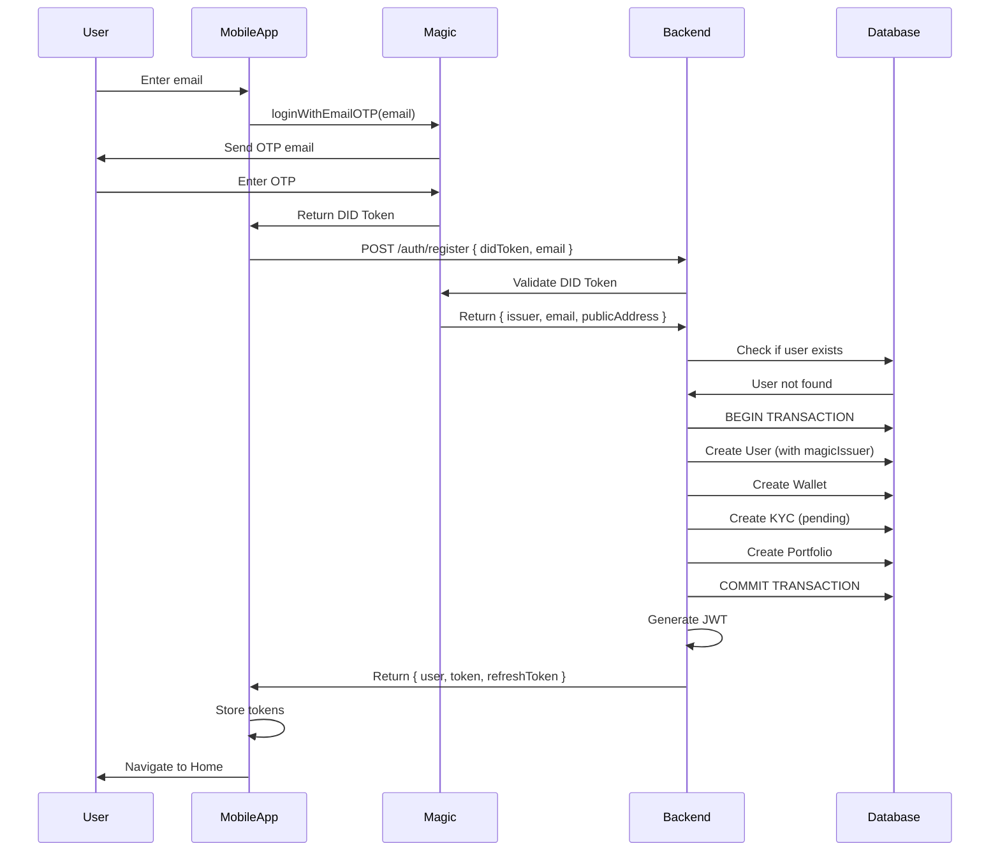
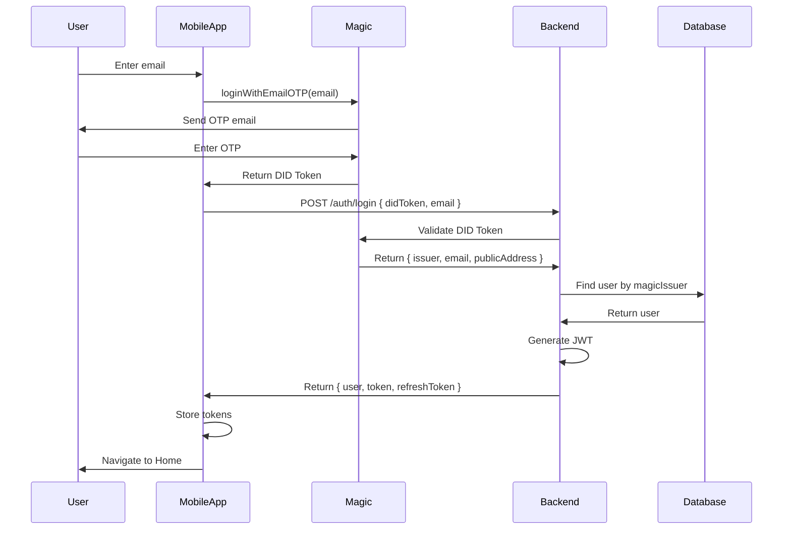
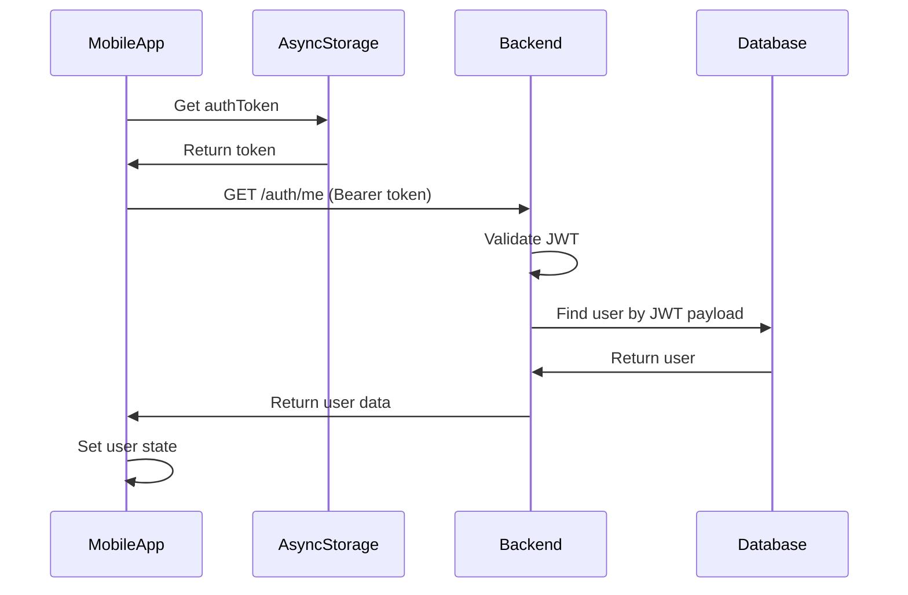

# Authentication Integration: Magic Link Passwordless OTP

**Version**: 1.0  
**Last Updated**: 2025-01-12  
**Purpose**: Complete Magic Link passwordless authentication integration strategy for Blocks mobile app

---

## Table of Contents

1. [Overview](#1-overview)
2. [Architecture](#2-architecture)
3. [Magic SDK Integration](#3-magic-sdk-integration)
4. [Backend Implementation](#4-backend-implementation)
5. [Authentication Flow](#5-authentication-flow)
6. [Role-Based Access Control](#6-role-based-access-control)
7. [Session Management](#7-session-management)
8. [Migration Strategy](#8-migration-strategy)
9. [Security Considerations](#9-security-considerations)
10. [Error Handling](#10-error-handling)

---

## 1. Overview

### Current State
- **Org Admins**: Password-based auth (`POST /org/auth/login`)
- **Users**: Admin-created only, no self-registration
- **Mobile App**: No authentication system

### Target State
- **Users**: Magic Link passwordless OTP (email/SMS)
- **Org Admins**: Keep existing password-based auth (separate system)
- **Platform Admins**: Keep existing password-based auth
- **Hybrid Approach**: Magic DID tokens validated, user records in Postgres

### Why Magic Link?
- **Passwordless**: No password management overhead
- **Secure**: Cryptographic proof with DID tokens
- **User-Friendly**: Email OTP, SMS OTP, or social logins
- **Non-Custodial**: Users control their authentication
- **Mobile-Optimized**: React Native SDK with Expo support

---

## 2. Architecture

### System Diagram

```
┌─────────────────┐
│   React Native  │
│   Mobile App    │
│                 │
│  Magic SDK      │
│  (Client-Side)  │
└────────┬────────┘
         │
         │ 1. Login with Email OTP
         │ 2. Receives DID Token
         │
         ▼
┌─────────────────┐
│   NestJS API    │
│                 │
│  Magic Admin    │────────┐
│  SDK            │        │
│  (Server-Side)  │        │ 3. Validate DID Token
└────────┬────────┘        │
         │                 │
         │ 4. User Lookup  ▼
         │              ┌──────────────┐
         ▼              │ Magic Service│
┌─────────────────┐    │ (External)   │
│   PostgreSQL    │    └──────────────┘
│                 │
│  - User         │
│  - Wallet       │
│  - Portfolio    │
│  - KYC          │
└─────────────────┘
```

### Components

1. **Frontend (React Native)**:
   - `@magic-sdk/react-native-expo`: Magic client SDK
   - Authentication UI (OTP input)
   - Token storage (AsyncStorage)
   - API client with Bearer token

2. **Backend (NestJS)**:
   - `@magic-sdk/admin`: Magic server SDK for DID validation
   - `MobileAuthModule`: New module for mobile authentication
   - `MagicAuthGuard`: Custom guard for protected routes
   - `JwtStrategy`: JWT validation for session tokens

3. **Database**:
   - Existing `User` entity (add Magic issuer field)
   - No password storage needed
   - Magic issuer as unique identifier

---

## 3. Magic SDK Integration

### 3.1 Frontend Setup

#### Installation
```bash
# React Native Expo
npm install @magic-sdk/react-native-expo
npm install react-native-safe-area-context
```

#### Magic Client Initialization
```typescript
// lib/magic.ts
import { Magic } from '@magic-sdk/react-native-expo';

export const magic = new Magic('pk_live_YOUR_PUBLISHABLE_KEY', {
  network: {
    rpcUrl: 'https://polygon-rpc.com',
    chainId: 137,
  },
});
```

#### Login Flow (Email OTP)
```typescript
// contexts/AuthContext.tsx
import { magic } from '@/lib/magic';

export const AuthProvider = ({ children }) => {
  const [user, setUser] = useState(null);
  const [loading, setLoading] = useState(true);

  const login = async (email: string) => {
    try {
      // 1. Trigger Magic login (sends OTP email)
      await magic.auth.loginWithEmailOTP({ email });
      
      // 2. Get DID token from Magic
      const didToken = await magic.user.getIdToken();
      
      // 3. Send DID token to backend
      const response = await fetch('https://api.blocks.com/api/mobile/auth/login', {
        method: 'POST',
        headers: { 'Content-Type': 'application/json' },
        body: JSON.stringify({ didToken, email }),
      });
      
      const data = await response.json();
      
      // 4. Store JWT from backend
      await AsyncStorage.setItem('authToken', data.token);
      await AsyncStorage.setItem('refreshToken', data.refreshToken);
      
      setUser(data.user);
      return data;
    } catch (error) {
      console.error('Login error:', error);
      throw error;
    }
  };

  const logout = async () => {
    try {
      // Logout from Magic
      await magic.user.logout();
      
      // Clear local storage
      await AsyncStorage.multiRemove(['authToken', 'refreshToken']);
      
      // Notify backend
      await fetch('https://api.blocks.com/api/mobile/auth/logout', {
        method: 'POST',
        headers: { Authorization: `Bearer ${token}` },
      });
      
      setUser(null);
    } catch (error) {
      console.error('Logout error:', error);
    }
  };

  const checkAuth = async () => {
    try {
      const token = await AsyncStorage.getItem('authToken');
      if (!token) {
        setLoading(false);
        return;
      }

      // Verify with backend
      const response = await fetch('https://api.blocks.com/api/mobile/auth/me', {
        headers: { Authorization: `Bearer ${token}` },
      });

      if (response.ok) {
        const userData = await response.json();
        setUser(userData);
      } else {
        // Token invalid, try refresh
        await refreshAuth();
      }
    } catch (error) {
      console.error('Auth check error:', error);
    } finally {
      setLoading(false);
    }
  };

  return (
    <AuthContext.Provider value={{ user, login, logout, loading }}>
      {children}
    </AuthContext.Provider>
  );
};
```

#### Auto-Reauth on App Launch
```typescript
// app/_layout.tsx
import { useAuth } from '@/contexts/AuthContext';

export default function RootLayout() {
  const { checkAuth, loading } = useAuth();

  useEffect(() => {
    checkAuth();
  }, []);

  if (loading) {
    return <SplashScreen />;
  }

  return <NavigationStack />;
}
```

---

### 3.2 Backend Setup

#### Installation
```bash
npm install @magic-sdk/admin
npm install @nestjs/jwt @nestjs/passport passport passport-jwt
npm install bcrypt  # For future password fields if needed
```

#### Magic Admin SDK Configuration
```typescript
// src/config/magic.config.ts
import { registerAs } from '@nestjs/config';

export default registerAs('magic', () => ({
  secretKey: process.env.MAGIC_SECRET_KEY,
  publishableKey: process.env.MAGIC_PUBLISHABLE_KEY,
}));
```

#### Environment Variables
```env
# .env
MAGIC_SECRET_KEY=sk_live_YOUR_SECRET_KEY
MAGIC_PUBLISHABLE_KEY=pk_live_YOUR_PUBLISHABLE_KEY
JWT_SECRET=your-jwt-secret-key
JWT_EXPIRES_IN=7d
JWT_REFRESH_EXPIRES_IN=30d
```

#### Magic Service
```typescript
// src/mobile-auth/services/magic.service.ts
import { Injectable, UnauthorizedException } from '@nestjs/common';
import { ConfigService } from '@nestjs/config';
import { Magic } from '@magic-sdk/admin';

@Injectable()
export class MagicService {
  private magic: Magic;

  constructor(private configService: ConfigService) {
    const secretKey = this.configService.get<string>('magic.secretKey');
    this.magic = new Magic(secretKey);
  }

  async validateDidToken(didToken: string): Promise<{
    issuer: string;
    email: string;
    publicAddress: string;
  }> {
    try {
      // Validate DID token
      await this.magic.token.validate(didToken);
      
      // Get user metadata from DID token
      const metadata = await this.magic.users.getMetadataByToken(didToken);
      
      return {
        issuer: metadata.issuer,  // Unique user ID from Magic
        email: metadata.email,
        publicAddress: metadata.publicAddress,
      };
    } catch (error) {
      throw new UnauthorizedException('Invalid or expired DID token');
    }
  }

  async getMetadataByIssuer(issuer: string) {
    try {
      return await this.magic.users.getMetadataByIssuer(issuer);
    } catch (error) {
      throw new UnauthorizedException('Failed to fetch user metadata');
    }
  }
}
```

---

## 4. Backend Implementation

### 4.1 Mobile Auth Module

```typescript
// src/mobile-auth/mobile-auth.module.ts
import { Module } from '@nestjs/common';
import { JwtModule } from '@nestjs/jwt';
import { ConfigModule, ConfigService } from '@nestjs/config';
import { PassportModule } from '@nestjs/passport';
import { MobileAuthController } from './mobile-auth.controller';
import { MobileAuthService } from './mobile-auth.service';
import { MagicService } from './services/magic.service';
import { JwtStrategy } from './strategies/jwt.strategy';
import { UsersModule } from '../users/users.module';
import { WalletModule } from '../wallet/wallet.module';
import { KycModule } from '../kyc/kyc.module';
import { PortfolioModule } from '../portfolio/portfolio.module';

@Module({
  imports: [
    PassportModule.register({ defaultStrategy: 'jwt' }),
    JwtModule.registerAsync({
      imports: [ConfigModule],
      inject: [ConfigService],
      useFactory: (config: ConfigService) => ({
        secret: config.get('JWT_SECRET'),
        signOptions: {
          expiresIn: config.get('JWT_EXPIRES_IN', '7d'),
        },
      }),
    }),
    UsersModule,
    WalletModule,
    KycModule,
    PortfolioModule,
  ],
  controllers: [MobileAuthController],
  providers: [MobileAuthService, MagicService, JwtStrategy],
  exports: [MobileAuthService, MagicService],
})
export class MobileAuthModule {}
```

### 4.2 Auth Service

```typescript
// src/mobile-auth/mobile-auth.service.ts
import { Injectable, UnauthorizedException, ConflictException } from '@nestjs/common';
import { JwtService } from '@nestjs/jwt';
import { MagicService } from './services/magic.service';
import { UsersService } from '../users/users.service';
import { DataSource } from 'typeorm';

@Injectable()
export class MobileAuthService {
  constructor(
    private magicService: MagicService,
    private usersService: UsersService,
    private jwtService: JwtService,
    private dataSource: DataSource,
  ) {}

  async login(didToken: string, email: string) {
    // 1. Validate DID token with Magic
    const magicMetadata = await this.magicService.validateDidToken(didToken);
    
    // 2. Verify email matches (optional security check)
    if (magicMetadata.email !== email) {
      throw new UnauthorizedException('Email mismatch');
    }

    // 3. Find or create user
    let user = await this.usersService.findByMagicIssuer(magicMetadata.issuer);
    
    if (!user) {
      // Auto-register user on first login
      user = await this.register(didToken, email, magicMetadata);
    }

    // 4. Generate JWT
    const tokens = await this.generateTokens(user);

    return {
      user: this.sanitizeUser(user),
      ...tokens,
    };
  }

  async register(didToken: string, email: string, magicMetadata?: any) {
    if (!magicMetadata) {
      magicMetadata = await this.magicService.validateDidToken(didToken);
    }

    // Check if user already exists with this email
    const existingUser = await this.usersService.findByEmail(email);
    if (existingUser) {
      throw new ConflictException('User with this email already exists');
    }

    // Transaction to create user + wallet + kyc + portfolio
    return await this.dataSource.transaction(async (manager) => {
      // Create user
      const user = await this.usersService.createWithMagic({
        email: magicMetadata.email,
        fullName: email.split('@')[0], // Default, user can update later
        magicIssuer: magicMetadata.issuer,
        magicPublicAddress: magicMetadata.publicAddress,
      }, manager);

      return user;
    });
  }

  async validateUser(userId: string) {
    const user = await this.usersService.findById(userId);
    if (!user || !user.isActive) {
      throw new UnauthorizedException('User not found or inactive');
    }
    return user;
  }

  async generateTokens(user: any) {
    const payload = {
      sub: user.id,
      email: user.email,
      role: user.role,
    };

    const accessToken = this.jwtService.sign(payload);
    const refreshToken = this.jwtService.sign(payload, { expiresIn: '30d' });

    return {
      token: accessToken,
      refreshToken,
    };
  }

  async refreshToken(refreshToken: string) {
    try {
      const payload = this.jwtService.verify(refreshToken);
      const user = await this.validateUser(payload.sub);
      return this.generateTokens(user);
    } catch (error) {
      throw new UnauthorizedException('Invalid refresh token');
    }
  }

  private sanitizeUser(user: any) {
    const { magicIssuer, magicPublicAddress, ...sanitized } = user;
    return sanitized;
  }
}
```

### 4.3 Auth Controller

```typescript
// src/mobile-auth/mobile-auth.controller.ts
import { Body, Controller, Post, Get, UseGuards, Request } from '@nestjs/common';
import { MobileAuthService } from './mobile-auth.service';
import { JwtAuthGuard } from './guards/jwt-auth.guard';
import { LoginDto, RegisterDto, RefreshTokenDto } from './dto';

@Controller('api/mobile/auth')
export class MobileAuthController {
  constructor(private authService: MobileAuthService) {}

  @Post('login')
  async login(@Body() dto: LoginDto) {
    return this.authService.login(dto.didToken, dto.email);
  }

  @Post('register')
  async register(@Body() dto: RegisterDto) {
    return this.authService.register(dto.didToken, dto.email);
  }

  @Post('refresh')
  async refresh(@Body() dto: RefreshTokenDto) {
    return this.authService.refreshToken(dto.refreshToken);
  }

  @Post('logout')
  @UseGuards(JwtAuthGuard)
  async logout(@Request() req) {
    // Optional: Invalidate token in Redis/database
    return { message: 'Logged out successfully' };
  }

  @Get('me')
  @UseGuards(JwtAuthGuard)
  async getMe(@Request() req) {
    return req.user;
  }
}
```

### 4.4 DTOs

```typescript
// src/mobile-auth/dto/login.dto.ts
import { IsString, IsEmail, IsNotEmpty } from 'class-validator';

export class LoginDto {
  @IsString()
  @IsNotEmpty()
  didToken: string;

  @IsEmail()
  @IsNotEmpty()
  email: string;
}

export class RegisterDto {
  @IsString()
  @IsNotEmpty()
  didToken: string;

  @IsEmail()
  @IsNotEmpty()
  email: string;

  @IsString()
  @IsNotEmpty()
  fullName: string;

  @IsString()
  phone?: string;
}

export class RefreshTokenDto {
  @IsString()
  @IsNotEmpty()
  refreshToken: string;
}
```

### 4.5 JWT Strategy

```typescript
// src/mobile-auth/strategies/jwt.strategy.ts
import { Injectable, UnauthorizedException } from '@nestjs/common';
import { PassportStrategy } from '@nestjs/passport';
import { ExtractJwt, Strategy } from 'passport-jwt';
import { ConfigService } from '@nestjs/config';
import { UsersService } from '../../users/users.service';

@Injectable()
export class JwtStrategy extends PassportStrategy(Strategy) {
  constructor(
    private configService: ConfigService,
    private usersService: UsersService,
  ) {
    super({
      jwtFromRequest: ExtractJwt.fromAuthHeaderAsBearerToken(),
      ignoreExpiration: false,
      secretOrKey: configService.get('JWT_SECRET'),
    });
  }

  async validate(payload: any) {
    const user = await this.usersService.findById(payload.sub);
    if (!user || !user.isActive) {
      throw new UnauthorizedException();
    }
    return user;
  }
}
```

### 4.6 JWT Auth Guard

```typescript
// src/mobile-auth/guards/jwt-auth.guard.ts
import { Injectable, ExecutionContext } from '@nestjs/common';
import { AuthGuard } from '@nestjs/passport';
import { Reflector } from '@nestjs/core';

@Injectable()
export class JwtAuthGuard extends AuthGuard('jwt') {
  constructor(private reflector: Reflector) {
    super();
  }

  canActivate(context: ExecutionContext) {
    // Check if route is public
    const isPublic = this.reflector.getAllAndOverride<boolean>('isPublic', [
      context.getHandler(),
      context.getClass(),
    ]);

    if (isPublic) {
      return true;
    }

    return super.canActivate(context);
  }
}
```

---

## 5. Authentication Flow

### 5.1 Registration Flow



### 5.2 Login Flow



### 5.3 Auto-Reauth Flow



---

## 6. Role-Based Access Control

### 6.1 User Roles

```typescript
// src/common/enums/user-role.enum.ts
export enum UserRole {
  USER = 'user',              // Mobile app users (investors)
  ORG_ADMIN = 'org_admin',    // Organization admins (read-only access to users/properties)
  PLATFORM_ADMIN = 'admin',   // Platform admins (full CRUD)
}
```

### 6.2 Role Permissions

| Role | Properties | Investments | Users | Organizations | Wallet | Transactions |
|------|------------|-------------|-------|---------------|--------|--------------|
| **USER** | Read (all), Create (investments) | Read (own), Create (own) | Read (own), Update (own) | Read (all) | Read (own), Update (own) | Read (own) |
| **ORG_ADMIN** | Read (org properties), Update (org properties) | Read (org investments) | Read (org investors) | Read (own org) | Read (org investors) | Read (org transactions) |
| **PLATFORM_ADMIN** | Full CRUD | Full CRUD | Full CRUD | Full CRUD | Full CRUD | Full CRUD |

### 6.3 Role Guard

```typescript
// src/common/guards/roles.guard.ts
import { Injectable, CanActivate, ExecutionContext } from '@nestjs/common';
import { Reflector } from '@nestjs/core';
import { UserRole } from '../enums/user-role.enum';

@Injectable()
export class RolesGuard implements CanActivate {
  constructor(private reflector: Reflector) {}

  canActivate(context: ExecutionContext): boolean {
    const requiredRoles = this.reflector.getAllAndOverride<UserRole[]>('roles', [
      context.getHandler(),
      context.getClass(),
    ]);

    if (!requiredRoles) {
      return true;
    }

    const { user } = context.switchToHttp().getRequest();
    return requiredRoles.some((role) => user.role === role);
  }
}
```

### 6.4 Roles Decorator

```typescript
// src/common/decorators/roles.decorator.ts
import { SetMetadata } from '@nestjs/common';
import { UserRole } from '../enums/user-role.enum';

export const Roles = (...roles: UserRole[]) => SetMetadata('roles', roles);
```

### 6.5 Usage Example

```typescript
// src/mobile/controllers/investments.controller.ts
import { Controller, Get, Post, UseGuards } from '@nestjs/common';
import { JwtAuthGuard } from '@/mobile-auth/guards/jwt-auth.guard';
import { RolesGuard } from '@/common/guards/roles.guard';
import { Roles } from '@/common/decorators/roles.decorator';
import { UserRole } from '@/common/enums/user-role.enum';
import { CurrentUser } from '@/common/decorators/current-user.decorator';

@Controller('api/mobile/investments')
@UseGuards(JwtAuthGuard, RolesGuard)
export class MobileInvestmentsController {
  
  @Get()
  @Roles(UserRole.USER)
  async getMyInvestments(@CurrentUser() user) {
    // Users can only see their own investments
    return this.investmentsService.findByUserId(user.id);
  }

  @Post()
  @Roles(UserRole.USER)
  async createInvestment(@CurrentUser() user, @Body() dto) {
    // Users can create investments
    return this.investmentsService.create(user.id, dto);
  }
}
```

---

## 7. Session Management

### 7.1 Token Expiration Strategy

| Token Type | Lifespan | Storage | Renewal |
|------------|----------|---------|---------|
| **DID Token** | 15 minutes | Not stored (single-use) | Generate new on login |
| **Access Token (JWT)** | 7 days | AsyncStorage | Manual refresh |
| **Refresh Token** | 30 days | AsyncStorage | Generate new on refresh |
| **Magic Session** | 7 days (default) | Magic SDK | Auto-refresh via Magic |

### 7.2 Token Refresh Implementation

```typescript
// services/api.ts
import AsyncStorage from '@react-native-async-storage/async-storage';

class ApiClient {
  private baseUrl = 'https://api.blocks.com';

  async request(endpoint: string, options: RequestInit = {}) {
    const token = await AsyncStorage.getItem('authToken');
    
    const response = await fetch(`${this.baseUrl}${endpoint}`, {
      ...options,
      headers: {
        'Content-Type': 'application/json',
        ...(token && { Authorization: `Bearer ${token}` }),
        ...options.headers,
      },
    });

    // Handle 401 Unauthorized
    if (response.status === 401) {
      const refreshed = await this.refreshToken();
      if (refreshed) {
        // Retry request with new token
        return this.request(endpoint, options);
      } else {
        // Refresh failed, logout user
        await this.logout();
        throw new Error('Session expired');
      }
    }

    return response.json();
  }

  async refreshToken() {
    try {
      const refreshToken = await AsyncStorage.getItem('refreshToken');
      if (!refreshToken) return false;

      const response = await fetch(`${this.baseUrl}/api/mobile/auth/refresh`, {
        method: 'POST',
        headers: { 'Content-Type': 'application/json' },
        body: JSON.stringify({ refreshToken }),
      });

      if (response.ok) {
        const data = await response.json();
        await AsyncStorage.setItem('authToken', data.token);
        await AsyncStorage.setItem('refreshToken', data.refreshToken);
        return true;
      }

      return false;
    } catch (error) {
      console.error('Token refresh error:', error);
      return false;
    }
  }

  async logout() {
    await AsyncStorage.multiRemove(['authToken', 'refreshToken']);
    // Redirect to login screen
  }
}

export const api = new ApiClient();
```

---

## 8. Migration Strategy

### 8.1 User Entity Updates

```sql
-- Add Magic-specific fields to users table
ALTER TABLE users 
ADD COLUMN magic_issuer VARCHAR(255) UNIQUE NULL,
ADD COLUMN magic_public_address VARCHAR(255) NULL,
ADD COLUMN auth_method VARCHAR(32) DEFAULT 'magic';

-- Create index for magic_issuer lookups
CREATE INDEX idx_users_magic_issuer ON users(magic_issuer);
```

```typescript
// src/admin/entities/user.entity.ts
@Entity('users')
export class User {
  // ... existing fields ...

  @Column({ type: 'varchar', length: 255, unique: true, nullable: true })
  magicIssuer?: string | null;

  @Column({ type: 'varchar', length: 255, nullable: true })
  magicPublicAddress?: string | null;

  @Column({ type: 'varchar', length: 32, default: 'magic' })
  authMethod: 'magic' | 'password';  // For future password support if needed
}
```

### 8.2 Backward Compatibility

- **Existing Users**: Can continue using admin-created accounts
- **Org Admins**: Keep password-based login (`POST /org/auth/login`)
- **Platform Admins**: Keep existing authentication
- **New Users**: Exclusively use Magic Link

### 8.3 Coexistence Strategy

```typescript
// src/users/users.service.ts
export class UsersService {
  async findByEmail(email: string) {
    return this.userRepository.findOne({ where: { email } });
  }

  async findByMagicIssuer(issuer: string) {
    return this.userRepository.findOne({ where: { magicIssuer: issuer } });
  }

  async createWithMagic(data: CreateMagicUserDto, manager?: EntityManager) {
    const repository = manager ? manager.getRepository(User) : this.userRepository;
    
    const user = repository.create({
      email: data.email,
      fullName: data.fullName,
      phone: data.phone,
      magicIssuer: data.magicIssuer,
      magicPublicAddress: data.magicPublicAddress,
      authMethod: 'magic',
      role: 'user',
      isActive: true,
    });

    await repository.save(user);

    // Auto-create related entities
    await this.createRelatedEntities(user, manager);

    return user;
  }

  private async createRelatedEntities(user: User, manager?: EntityManager) {
    // Create Wallet
    await this.walletService.create({ userId: user.id }, manager);
    
    // Create KYC (pending)
    await this.kycService.create({ userId: user.id, status: 'pending' }, manager);
    
    // Create Portfolio
    await this.portfolioService.create({ userId: user.id }, manager);
  }
}
```

---

## 9. Security Considerations

### 9.1 DID Token Validation

```typescript
// Always validate DID token on server-side
// NEVER trust client-provided user info without validation

async login(didToken: string, email: string) {
  // 1. Validate token with Magic (cryptographic verification)
  const metadata = await this.magicService.validateDidToken(didToken);
  
  // 2. Verify email matches token
  if (metadata.email !== email) {
    throw new UnauthorizedException('Email mismatch');
  }
  
  // 3. Check token hasn't been used before (optional: implement token replay protection)
  // ... token replay check logic ...
  
  // 4. Proceed with user lookup/creation
}
```

### 9.2 Token Replay Protection (Optional)

```typescript
// src/mobile-auth/services/token-blacklist.service.ts
import { Injectable } from '@nestjs/common';
import { RedisService } from '@/common/redis/redis.service';

@Injectable()
export class TokenBlacklistService {
  constructor(private redis: RedisService) {}

  async isTokenUsed(didToken: string): Promise<boolean> {
    const key = `did_token:${didToken}`;
    const exists = await this.redis.exists(key);
    return exists === 1;
  }

  async markTokenUsed(didToken: string, expiresIn: number = 900) {
    const key = `did_token:${didToken}`;
    await this.redis.setex(key, expiresIn, '1');
  }
}
```

### 9.3 Rate Limiting

```typescript
// src/mobile-auth/mobile-auth.controller.ts
import { ThrottlerGuard } from '@nestjs/throttler';

@Controller('api/mobile/auth')
@UseGuards(ThrottlerGuard)
export class MobileAuthController {
  @Post('login')
  @Throttle(5, 60)  // 5 attempts per 60 seconds
  async login(@Body() dto: LoginDto) {
    return this.authService.login(dto.didToken, dto.email);
  }
}
```

### 9.4 HTTPS Only

```typescript
// Enforce HTTPS in production
if (process.env.NODE_ENV === 'production') {
  app.use((req, res, next) => {
    if (req.header('x-forwarded-proto') !== 'https') {
      res.redirect(`https://${req.header('host')}${req.url}`);
    } else {
      next();
    }
  });
}
```

---

## 10. Error Handling

### 10.1 Common Error Scenarios

```typescript
// src/mobile-auth/mobile-auth.service.ts
import { 
  UnauthorizedException, 
  ConflictException, 
  BadRequestException 
} from '@nestjs/common';

export class MobileAuthService {
  async login(didToken: string, email: string) {
    try {
      const metadata = await this.magicService.validateDidToken(didToken);
      
      if (metadata.email !== email) {
        throw new UnauthorizedException('Email mismatch');
      }

      // ... rest of login logic ...
    } catch (error) {
      if (error.code === 'TokenExpired') {
        throw new UnauthorizedException('DID token has expired, please login again');
      }
      
      if (error.code === 'MalformedTokenError') {
        throw new BadRequestException('Invalid DID token format');
      }
      
      if (error.code === 'IncorrectSignerAddress') {
        throw new UnauthorizedException('Token signature verification failed');
      }
      
      throw error;
    }
  }
}
```

### 10.2 Frontend Error Handling

```typescript
// contexts/AuthContext.tsx
const login = async (email: string) => {
  try {
    await magic.auth.loginWithEmailOTP({ email });
    const didToken = await magic.user.getIdToken();
    
    const response = await api.post('/auth/login', { didToken, email });
    // ... handle success ...
  } catch (error) {
    if (error.message.includes('expired')) {
      Alert.alert('Session Expired', 'Please try logging in again.');
    } else if (error.message.includes('mismatch')) {
      Alert.alert('Error', 'Email verification failed. Please try again.');
    } else if (error.message.includes('signature')) {
      Alert.alert('Security Error', 'Authentication verification failed.');
    } else {
      Alert.alert('Login Failed', 'An unexpected error occurred. Please try again.');
    }
    
    // Log error for debugging
    console.error('Login error:', error);
  }
};
```

---

## Summary

### Implementation Checklist

#### Backend
- [ ] Install `@magic-sdk/admin` and JWT packages
- [ ] Create `MobileAuthModule` with Magic service
- [ ] Add `magicIssuer` and `magicPublicAddress` fields to User entity
- [ ] Implement login/register/refresh/logout endpoints
- [ ] Create JWT strategy and auth guard
- [ ] Implement role-based access control
- [ ] Add rate limiting to auth endpoints
- [ ] Set up token refresh mechanism
- [ ] Configure CORS for mobile app

#### Frontend
- [ ] Install `@magic-sdk/react-native-expo`
- [ ] Create `MagicService` wrapper
- [ ] Implement `AuthContext` with login/logout/checkAuth
- [ ] Create login screen with email OTP
- [ ] Implement token storage (AsyncStorage)
- [ ] Add auto-refresh token logic
- [ ] Create auth-protected route wrapper
- [ ] Handle session expired scenarios
- [ ] Add biometric login (optional, future enhancement)

#### Database
- [ ] Run migration to add Magic fields to users table
- [ ] Create indexes on `magicIssuer`
- [ ] Ensure unique constraint on `magicIssuer`

#### Testing
- [ ] Test login flow end-to-end
- [ ] Test registration with auto-entity creation
- [ ] Test token expiration and refresh
- [ ] Test logout and session cleanup
- [ ] Test role-based access control
- [ ] Test error scenarios (expired token, invalid email, etc.)

### Next Steps

1. **Deploy Magic Integration**: Set up Magic account, get API keys
2. **Implement Auth Endpoints**: Create all mobile auth endpoints
3. **Frontend Integration**: Connect mobile app to auth endpoints
4. **Test Authentication Flow**: End-to-end testing
5. **WebSocket Integration**: Add real-time session management (see `REALTIME_ARCHITECTURE.md`)
6. **Deploy to Production**: Configure production Magic keys and JWT secrets

---

## Cross-Reference

- **Database Changes**: See `DATABASE_SCHEMA_ALIGNMENT.md` for User entity updates
- **API Endpoints**: See `API_MAPPING.md` for auth endpoint specifications
- **Real-time Updates**: See `REALTIME_ARCHITECTURE.md` for session events
- **Implementation Phases**: See `API_IMPLEMENTATION_PLAN.md` for auth implementation timeline
- **Cursor Prompts**: See `CURSOR_PROMPTS.md` for step-by-step implementation prompts

